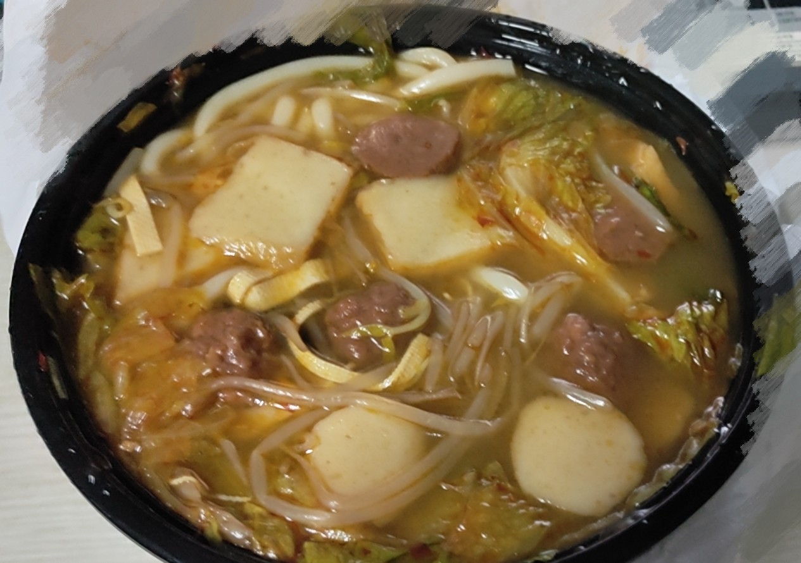
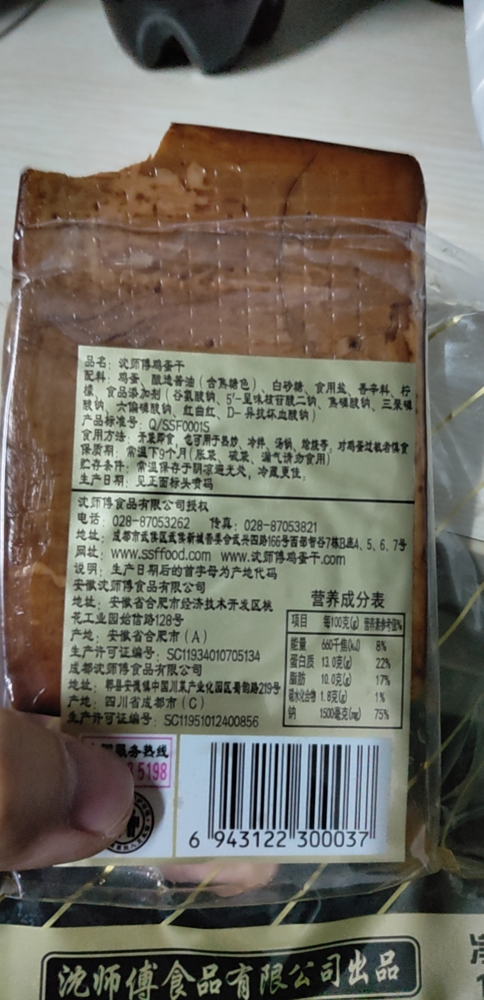
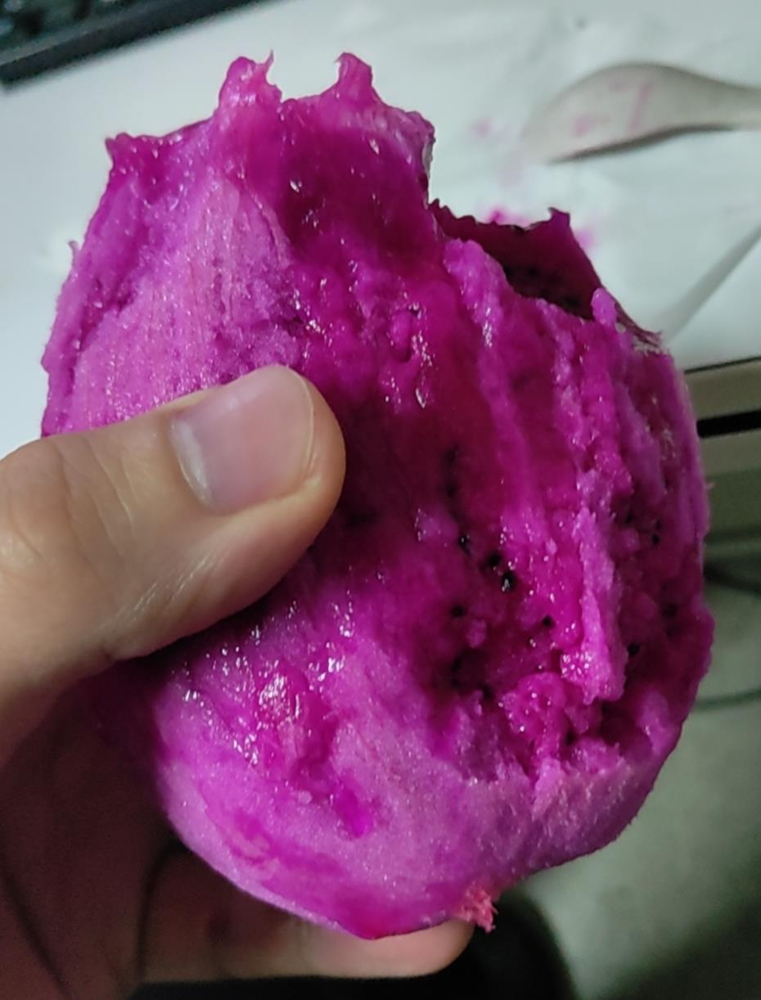

## 背部训练

- [x] 硬拉 30kg 3*12
- [x] 固定器械引体向上 71.5kg 1\*12 + 
                        65kg 1\*12 + 58.5kg 1\*12 
- [x] 坐姿划船 30kg 2\*12 + 35kg 1\*12
- [x] 高位下拉 30kg 2\*12 + 35kg 1\*12
- [x] 绳索下压 25kg 3*12
- [x] 山羊挺身 2*20
- [x] 游泳 20*25m = 500m

饮食也是训练的一部分：  

### 小可爱点的米线
{height=100% width=70%}

### 鸡蛋干  
{height=70% width=70%}

### 手剥火龙果  
{height=70% width=70%}

