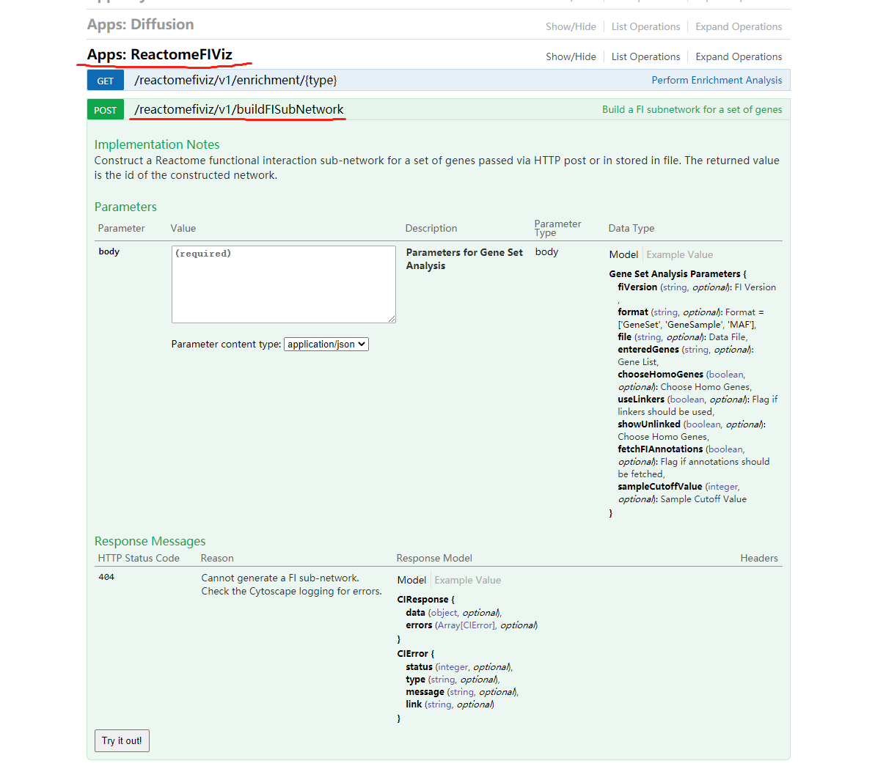

### Preface

经过我的一番摸索，终于搞明白了，这个R包本身说明并不详细，具体参数基本全靠猜，当然我还参考了[Cytoscape automation in R using Rcy3](https://bioconductor.github.io/BiocWorkshops/cytoscape-automation-in-r-using-rcy3.html)(仅仅参考了一行代码)，累死我了- -！

#### 1. 安装R包["RCy3"](https://bioconductor.org/packages/release/bioc/html/RCy3.html)

```r
if (!requireNamespace("BiocManager", quietly = TRUE))
    install.packages("BiocManager")

BiocManager::install("RCy3")
```

#### 2. 调用函数cyrestPOST

本文以Cytoscape中的Reactome FI Apps中的"Gene Set/Mutation Analysis"功能生成网络图，并导出为csv文件为例具体讲解自动化(Automation)流程。  
  
废话不多说，直接导入下面代码，并修改相应的path 

```r
library(RCy3)
filename.input <- 'path.of.your.input.file'
filename.output <- 'path.of.your.output.file'
)
body.reactome <- list(
  fiVersion = '2019', # Reactome FI Networks Version, 不同版本结果不同
  format = 'GeneSet', # Specify format
  file = filename.input, # 对应的是GUI中的 Choose data file：
  enteredGenes = 'null', # 对应的是GUI中的 Or enter gene set：
  chooseHomoGenes = FALSE,
  useLinkers = FALSE, # 对应的是GUI中的 Use linker genes：
  showUnlinked = FALSE, # 对应的是GUI中的 Show genes not linked to others：
  fetchFIAnnotations = TRUE, # 对应的是GUI中的 Fetch FI annotations：
  sampleCutoffValue = '4'
)
body.export <- list(network = 'current', # 默认参数值，即当前窗口显示的网络
                    options = 'CSV', # 输出的文件格式
                    outputFile = filename.output) # 输出的文件名(最好为绝对路径)

# 调用Reatome FI 这个Apps中的"Gene Set/Mutation Analysis"功能
cyrestPOST(operation = 'reactomefiviz/v1/buildFISubNetwork',
             body = body.reactome,
             base.url = 'http://localhost:1234')
             
# 以边的形式导出网络表格           
cyrestPOST(operation = 'v1/commands/network/export',
           body = body.export,
           base.url = 'http://localhost:1234')
```

值得说明的是，有一系列cyrest的函数：

```r
cyrestPUT()
cyrestGET()
cyrestPOST()
cyrestDELETE()
cyrestAPI()

```

具体使用哪一个需要参考[CyREST API](http://localhost:1234/v1/swaggerUI/swagger-ui/index.html?url=http://localhost:1234/v1/sagger.json#/)和[CyREST Command API](http://localhost:1234/v1/swaggerUI/swagger-ui/index.html?url=http%3A%2F%2Flocalhost%3A1234%2Fv1%2Fcommands%2Fswagger.json).

例如要调用Reactome FI 中的富集分析功能，那就去[CyREST API](http://localhost:1234/v1/swaggerUI/swagger-ui/index.html?url=http://localhost:1234/v1/sagger.json#/)中找到相应的函数点进去：



POST则调用cyrestPOST()，以此类推。后面那串去掉第一个斜杠复制到参数operation中即可。至于参数body则需要在网页生成json格式，在根据本文的格式一一对照修改即可。base.url则是默认参数，一般无需修改。

还需注意的是程序运行时需要保持Cytoscape打开，并且处于正常运行状态，因为其命令传递方式大概是，通过Rstudio传到swagger服务器，再从服务器转到本机的Cytoscape。

最后，其他更详细信息请参考[Cytoscape-automation](https://github.com/cytoscape/cytoscape-automation/wiki#r-notebooks-and-scripts)(虽然我觉得应该够用了，嘻嘻)。


